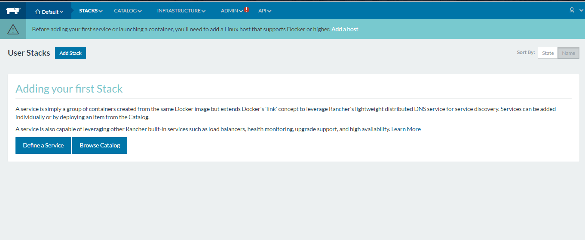

### Installing Rancher

Please check that docker is installed on the machine. Or kindly visit docker official site to install it.

Check docker is installed

**Make sure that the docker version is less than or equal to 12**

Rancher do not support the latest docker version which is v13

```
docker version
```

Sample Output:

```
docker version
Client:
 Version:      1.12.1
 API version:  1.26
 Go version:   go1.7.5
 Git commit:   092cba3
 Built:        Wed Feb  8 06:50:14 2017
 OS/Arch:      linux/amd64

Server:
 Version:      1.12.1
 API version:  1.26 (minimum version 1.12)
 Go version:   go1.7.5
 Git commit:   092cba3
 Built:        Wed Feb  8 06:50:14 2017
 OS/Arch:      linux/amd64
 Experimental: false
```

Now we can install rancher by the below command:

```
docker run -d --restart=unless-stopped -p 8080:8080 rancher/server
```

Smaple Output:

```
 docker run -d --restart=unless-stopped -p 8080:8080 rancher/server
Unable to find image 'rancher/server:latest' locally
latest: Pulling from rancher/server
6599cadaf950: Pull complete
23eda618d451: Pull complete
f0be3084efe9: Pull complete
52de432f084b: Pull complete
a3ed95caeb02: Pull complete
e75cd91a1dc5: Pull complete
997f1b48f59f: Pull complete
313c28fb4e37: Pull complete
2a0730d1275c: Pull complete
8848fbebd2c8: Pull complete
06e9d9cdf8d3: Pull complete
356cc53c66d1: Pull complete
e8eac18c3a5f: Pull complete
1bb4a26539b6: Pull complete
d947b13ce0a9: Pull complete
30fd59282094: Pull complete
9ce88bb04be8: Pull complete
3650eadaa12c: Pull complete
19011cb0fba2: Pull complete
Digest: sha256:a815bbc4c9814c962b3c2a4bc6b73ce114896fdb72de076f8c09a2bb3e84e53b
Status: Downloaded newer image for rancher/server:latest
7d58c51c7d8dcb353b62beca9ca7fe245210376315490f5dfe7b493054b2445f
```

After the completion, kindly wait for a minute and check whether Rancher is running or not by:

```
docker ps
```

Sample Output:

```
docker ps
CONTAINER ID        IMAGE               COMMAND                  CREATED             STATUS              PORTS                              NAMES
7d58c51c7d8d        rancher/server      "/usr/bin/entry /u..."   3 minutes ago       Up 3 minutes        3306/tcp, 0.0.0.0:8080->8080/tcp   romantic_raman
```

Now check your browser with machineip:8080

```
Machine_IP:8080
```



Now the Rancher has been installed.
