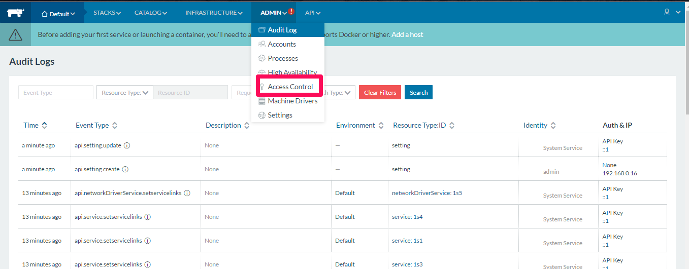
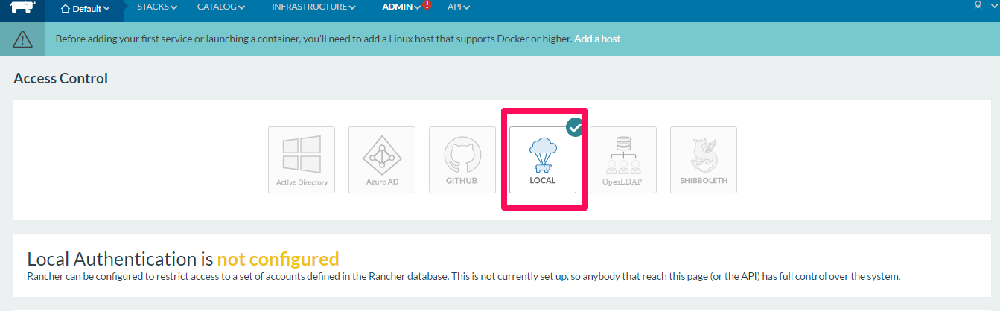
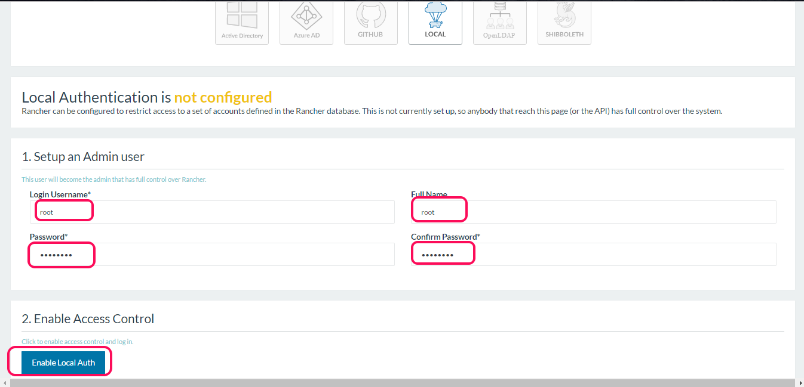

### Access control

This is a critical step where we have to assign what all the users can access Rancher,

Follow the below step:

select admin and select access control

There are many options here, we are going to selet local,

Now scroll down and set the username and password for the user and save it.

After if we try accessing the Rancher, it will ask for the credentials, we should provide the correct credetials.
