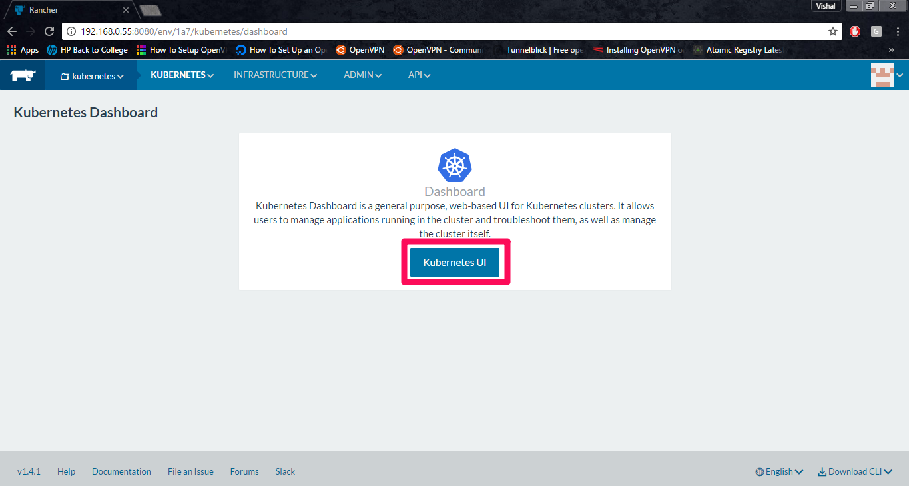
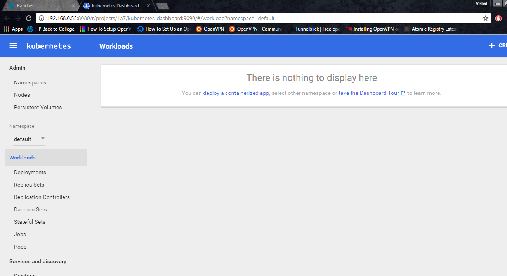
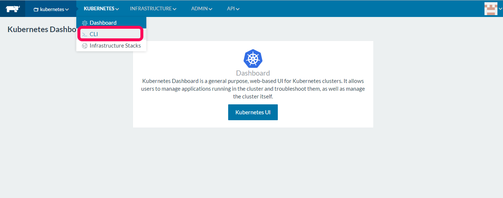
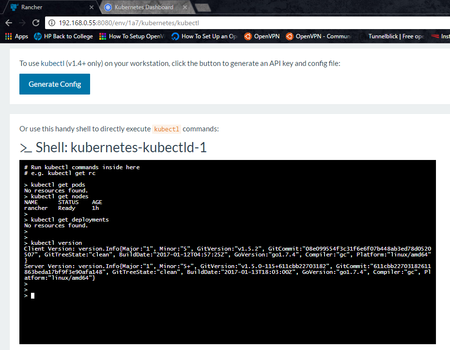

To start the process of deploying the cluster in Rancher, first we need to create a Host.

###Adding a host in Rancher

To add the first node to the environment, Click on Infrastructure and select host,


Now select add host


Now give the correct url where the rancher is created and save it.


Now scrool down we can see the 4th point where there is a command, copy it &


Now paste the copied command in the host machine where Rancher is running.

Sample Output:

```
docker run -d --privileged -v /var/run/docker.sock:/var/run/docker.sock -v /var/lib/rancher:/var/lib/rancher rancher/agent:v1.2.0 http://192.168.0.78:808 0/v1/scripts/1144CEFC8755F554393F:1483142400000:2YVEkFG9lU4R6BRs4qjQWETVVsA
Unable to find image 'rancher/agent:v1.2.0' locally
v1.2.0: Pulling from rancher/agent
b3e1c725a85f: Pull complete
4daad8bdde31: Pull complete
63fe8c0068a8: Pull complete
4a70713c436f: Pull complete
bd842a2105a8: Pull complete
3f7d6fd71888: Pull complete
16914729cfd3: Pull complete
62aa7bf0246d: Pull complete
Digest: sha256:09847e60bb0ec4c5664352349616e356167e6d81c74041f1eb9d7b44984c5515
Status: Downloaded newer image for rancher/agent:v1.2.0
1fe6ced72445e04ff57f562aa2ea682e9daf03feb213b869cdea8178f9495624
```

Once when you have added a node and check the console, you will see that the Kubernetes cluster have been started to deploy.


After the completion of this, you will be seeing the below image.

You can click on the Kubernetes UI to check the UI of your cluster.





To open the command line for the kubectl, Click on Kubernetes -> CLI






To start working in Kubernetes, check the below GitHub tutorial,

https://github.com/Venkat-Sudharsanam/kubernetes-fundamentals
